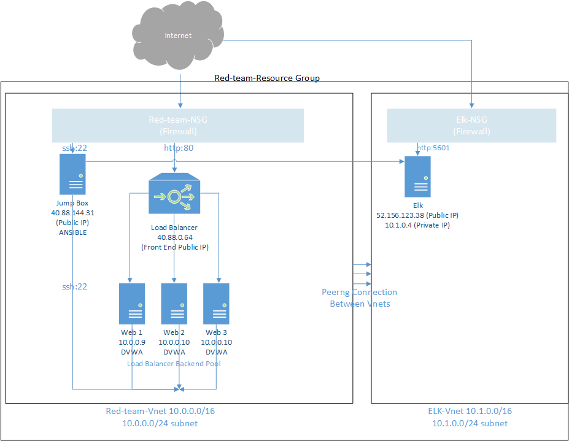
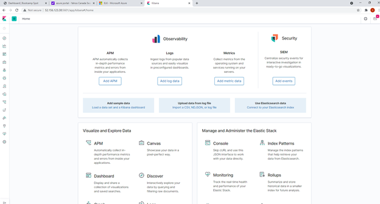

## Automated ELK Stack Deployment

The files in this repository were used to configure the network depicted below.

These files have been tested and used to generate a live ELK deployment on Azure. They can be used to either recreate the entire deployment pictured above. Alternatively, select portions of the [Filebeat & Metricbeat YMl Playbook file](filebeat_and_metricbeat_install.yml) file may be used to install only certain pieces of it, such as Filebeat or Metricbeat.

The various playbook files for this architecture can be found here:
[DVWA Playbook file](dvwa.yml)
[Install ELK Playbook file](install_elk.yml)
[Filebeat & Metricbeat YMl Playbook file](filebeat_and_metricbeat_install.yml)

These documents contains the following details:
- Description of the Topology
- Access Policies
- ELK Configuration
  - Beats in Use
  - Machines Being Monitored
- How to Use the Ansible Build

### Description of the Topology

The main purpose of this network is to expose a load-balanced and monitored instance of DVWA, the D*mn Vulnerable Web Application.

Load balancing ensures that the application will be accessable with a high level of redudnancy protection, in addition to restricting unauthorized access to the network.

Within this architecture, we have deployed a load balancer within the Red-Team-Vnet that acts as the front-end to external users connecting to our Web servers.  This load balancer has a front-end public IP address that takes in all external web traffic requests and distributes them across the running web servers.  In the event of one (or two) webservers go down for any reason including but not limited to maintenance, an overburden of traffic (DDos) etc, the load balancer ensures web services are always online.  In our deployment we have 3 webservers running in our load balancer backend pool, however we can easily add more should resourcing contraints be identified.

In additon to the load balancer, we have deployed a Jumpbox within the Red-Team-Vnet (with an external IP address) with an ansible container that is used as our provisioner across all machines within the Red-Team-Resource_Group. The benefit to deploying a jumpbox with an ansible container to act as our provisioner within our architechture, is that we have been able to create custom YML playbooks that provision our machines to a uniform standard seamlessly without the potential for human error.

Within the Elk-Vnet, we deployed an ELK VM server and provisioned it by via our Jumpbox ansible container using the [Install ELK YML Playbook file](install_elk.yml). Once provisioned, we installed filebeat and metric beat to our web servers via our Jumpbox ansible container using the [Filebeat & Metricbeat YMl Playbook](filebeat_and_metricbeat_install.yml).

Integrating an ELK server allows users to easily monitor the vulnerable VMs for changes to web traffic and system resources.
- Filebeat, an important element of our webserver deployment, sends web traffic logs from our web servers over to our ELK servers.  From there, the ELK server analyses the data and allows for visual review using Kibana.
- Metricbeat, similar to filebeat, logs and sends data from the webservers to the ELK server. However instead of web traffic data, Metricbeat sends web server system resource data to the ELK sever for review and analysis that can be be best visualized using Kibana.

The configuration details of each machine may be found below.

| Name     | Function | IP Address | Operating System |
|----------|----------|------------|------------------|
| Jump Box | Gateway  | 40.88.144.31  | Linux            |
| Load Balancer     |      Balance Traffic    |     40.88.0.64       |        Linux          |
| Web_1     | Web Server w/ DVWA container        |     10.0.0.9       |          Linux        |
| Web_2     |     Web Server w/ DVWA container    |     10.0.0.10       |      Linux            |
| Web_3     |     Web Server w/ DVWA container     |     10.0.0.11       |      Linux            |
| ELK Server     |     Log Management    |     52.156.123.38 (External)       |      Linux            |
|    |         |     10.1.0.4 (Internal)      |      Linux            |

### Access Policies
There are three resources that have public IP addresses: (1) Jumpbox, (2) Load Balancer, and (3) ELK Server

The machines on the internal network are not exposed to the public Internet: Web_1, Web_2, and Web_3. 

- There are no restrictions on where web traffic on port 8o connects from when connecting to the web servers through the the front-end public IP address of the load balancer.
- The jumpbox machine will only allow SSH connection on port 22 from the following public IP address: 76.71.37.48 (my public address for remote connection for administration)
- The ELK server will only allow http connection on port 5601 from the following public IP address: 76.71.37.48 (my public address for remote connection for log administration)

Machines within the network can only be accessed by eachother and through the jumpbox.
- The ELK server can be accessed from outside the network through the jumpbox, and also via any resource within the Red-Team-Vnet due to a peering connection from Red-Team-Vnet to ELK-Vnet.

A summary of the access policies in place can be found in the table below.

| Name     | Publicly Accessible | Allowed IP Addresses | Port |
|----------|---------------------|----------------------|---|
| Jump Box | Yes              | 76.71.37.48    | 22 |
|      Load Balancer    | Yes                    |        Any              | 80|
|     Web_1     |     No                |         40.88.0.64 (load balancer)             |
|     Web_2     |     No                |         40.88.0.64 (load balancer)             |
|     Web_3     |     No                |         40.88.0.64 (load balancer)             |
|     ELK     |     Yes                |         76.71.37.48             | 5601|

### Elk Configuration

Ansible was used to automate configuration of the ELK machine. No configuration was performed manually, which is advantageous because we were able to setup a preconfifured ELK setup automatically and any element of human error was removed.  This is a scalable deployment, meaning any additional identical deployment can be easily achieved by adding additional host IP addresses to the ansible hosts file from the provisioner.

The playbook implements the following tasks:
- Installs Docker.io
- Installs python3-pip
- Installs Docker module
- Sets increased virtual memory to ensure seamless running of ELK
- Sets increased virutual memory to restore after a system restart or shutdown
- Dowloads and Installs a Docker ELK container and sets preset/pre-established parameters including published ports
- Sets docker service to run on boot

The following screenshot displays the result of running `docker ps` after successfully configuring the ELK instance.

### Target Machines & Beats
This ELK server is configured to monitor the following machines:
- Web_1: 10.0.0.9
- Web_2: 10.0.0.10
- Web_3: 10.0.0.11

We have installed the following Beats on these machines:
- Filebeats: Web_1, Web_2, Web_3
- Metricbeats: Web_1, Web_2, Web_3

These Beats allow us to collect the following information from each machine:
- Filebeats allows us to log and analyse (through ELK) web traffic of the monitored machines.  In the event of an issue, we can see what/where traffic was originating from to help us figure out what happened.
- Metricbeats allows us to log and analyze (through ELK) system resources of the monitored machines.  In the event of an issue, we can see what was happening with system resources during the time period in question.

### Using the Playbook
In order to use the playbook, you will need to have an Ansible control node already configured. Assuming you have such a control node provisioned: 

SSH into the control node and follow the steps below:
- Copy the YML playbook file to /etc/ansible/.
- Update the hosts file to ensure the appropriate hostname is defined and the repsective host IP addresses are identified.
- Update the ansible.cfg file to ensure the remote user is correct
- Run the playbook, and navigate to the host VM to check that the installation worked as expected.  You can do this by connecting via SSH and running sudo docker ps -a to ensure the docker container is up and running.

Once your install ELK playbook has run, you can ensure things are up and running by navigating to the ELK (Kibana) web page to validate system logs have been recived and analyzed by connecting to http://[elk_IP_address]/app/kibana#/home

You should see something like the following:
